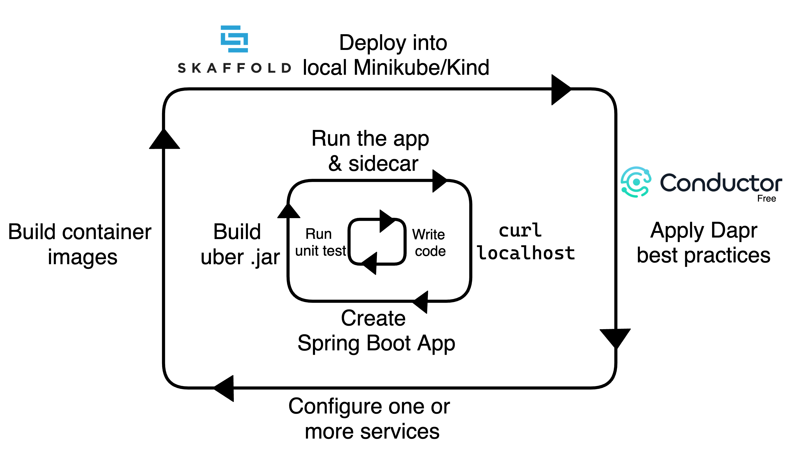

# Dapr Skaffold Example

## Overview
This example demonstrates how to perform local development with [Dapr](https://dapr.io/), [Skaffold](https://skaffold.dev/), and [Diagrid Conductor](https://www.diagrid.io/conductor). It covers:
- Mocking Dapr client and unit testing applications.
- Running multiple applications with Dapr multi-app run.
- Deploying applications to a local Kubernetes cluster with Skaffold, and observing real-time redeployment for application code changes or Dapr CRD changes.



For a detailed step by step write, check out the blog post walking through these project steps.

## Prerequisites

### Install Kubernetes
To install Kubernetes on macOS, use the following commands:
```bash
brew install minikube
minikube start
```

### Install Dapr and Diagrid Conductor
Follow the steps in the [quickstart guide](https://docs.diagrid.io/conductor/getting-started/quickstart/) and apply your unique cluster connection token:
```bash
kubectl apply -f "YOUR_UNIQUE_CLUSTER_CONNECTION_TOKEN"
```

### Install Skaffold
To install Skaffold, use the following command:
```bash
brew install skaffold
```

### Install Redis
Install Redis using Helm:
```bash
helm repo add bitnami https://charts.bitnami.com/bitnami
helm repo update
helm install redis bitnami/redis --set cluster.enabled=false --set replica.replicaCount=0 --set fullnameOverride=dapr-dev-redis
```

## Build the Application
This project comprises a Java app that publishes messages to Redis and another Java app that consumes these messages.

Clone the repository:
```bash
git clone git@github.com:bibryam/dapr-skaffold.git
cd dapr-skaffold
```

Build the Java applications and run unit tests:
```bash
mvn clean install
```

## Run a Single Application
Use Dapr CLI to run a single application with a sidecar:
```bash
dapr run --app-id publisher --app-port 5001 --resources-path ./common/local -- java -jar publisher/target/Publisher-0.0.1-SNAPSHOT.jar
```

## Run Multiple Applications
Run both applications at the same time with multi-app run:
```bash
dapr run -f dapr.yaml
```

## Deploy the Applications to Kubernetes
To deploy the application, run:
```bash
skaffold dev
```

## Sync Changes
Update the application YAML files or modify the Java code followed by a Maven build. The changes will be detected and redeployed automatically.

## Test APIs with a Single Request
Publish a single order by calling the Publisher application:
```bash
curl -X POST http://localhost:5001/pubsub/orders \
-H "Content-Type: application/json" \
-d @order.json
```

Or use Dapr CLI to publish an order directly to the pubsub:
```bash
dapr publish --publish-app-id publisher --pubsub pubsub --topic orders --data '{"orderId": "123"}'
```

## Test APIs with Multiple Requests

### Install Apache Bench
```bash
brew install httpd
```

### Perform Load Testing
```bash
ab -n 100 -c 100 -p order.json -T "application/json" http://localhost:5001/pubsub/orders       
ab -n 100 -c 100 -p order.json -T "application/json" http://localhost:3501/v1.0/publish/pubsub/orders       
```
